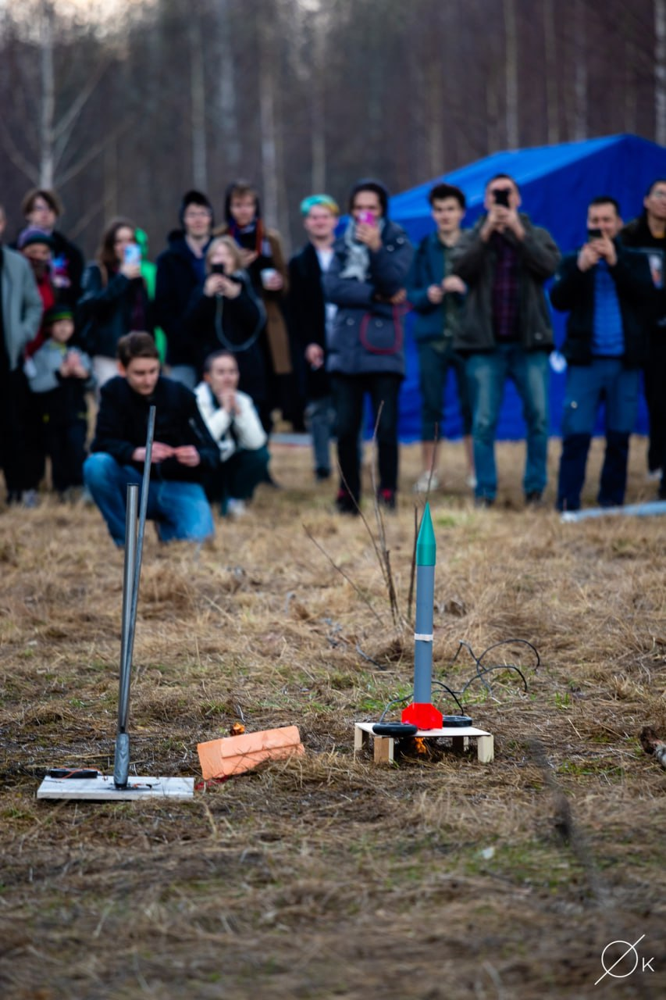

# Rocket launching on MIPT rocket-contest 2023

## Approximate calculating of rocket trajectory

Theory from [the article](https://lisakov.com/blog/air-resistance/#reshenie)
Height was approx 150-200 m in calculation. It was same in reality. 

## Plans and creation of the rocket on 3D-printer

It is like submodules in this repo and [in repo my teammate Kafi](https://github.com/kafiulshabbir/rocket2023/tree/4d35ce447f1effe4cd78548715952e39a7479d0e)

## Details

### The engine from the shop "Podarini"
Rocket motors RD1-30-5

### Else details

It was from LC-411 at MIPT and 'phystech fabrica'

## Results 

 

